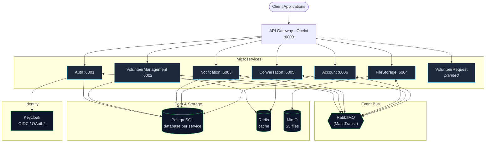

# PetFamily Backend
 
[](https://dotnet.microsoft.com/)
[](https://www.postgresql.org/)
[](https://www.rabbitmq.com/)
[](https://www.keycloak.org/)
[](https://docs.docker.com/compose/)
[](./LICENSE)
[](https://github.com/haxnted/pet-family-backend-new/commits)
[](https://github.com/haxnted/pet-family-backend-new/stargazers)
 
> A production-grade **.NET 10 microservices reference project** for an animal shelter management domain.
> Built around **DDD**, **CQRS**, **Clean Architecture**, **Event-Driven** messaging and full **observability**.
 
Volunteers can register, manage shelters and pet profiles, run adoption chats, upload photos and receive email notifications — all orchestrated by independent microservices communicating over RabbitMQ with MassTransit sagas.
 
---
 
## Table of Contents
 
- [Architecture](#architecture)
- [Microservices](#microservices)
- [Quick Start](#quick-start)
- [Available Services](#available-services)
- [Project Structure](#project-structure)
- [Tech Stack](#tech-stack)
- [Architectural Patterns](#architectural-patterns)
- [Health Checks](#health-checks)
- [Configuration](#configuration)
- [Testing](#testing)
- [License](#license)
---
 
## Architecture
 

 
Every microservice runs as **two hosts**:
 
- **Endpoints** — HTTP API (ASP.NET Core)
- **Consumers** — RabbitMQ event handlers (MassTransit)
---
 
## Microservices
 
| Service | Description | Port (Docker) | DB Port |
|---|---|:---:|:---:|
| **API Gateway** | Single entry point, routing, rate limiting | 6000 | — |
| **Auth** | Authentication, JWT, refresh tokens, Keycloak integration | 6001 | 5432 |
| **VolunteerManagement** | Volunteers, shelters, pets, adoption saga | 6002 | 5433 |
| **Notification** | Email notifications, user preferences | 6003 | 5434 |
| **FileStorage** | MinIO file storage, pre-signed URLs | 6004 | — |
| **Conversation** | Chats between volunteers and adopters | 6005 | 5438 |
| **Account** | User profiles, photos, contacts | 6006 | 5437 |
| **VolunteerRequest** | Volunteer applications *(planned)* | — | 5435 |
 
---
 
## Quick Start
 
### Requirements
 
- Docker & Docker Compose
- .NET SDK 10.0+ (only for local development)
### Configure secrets
 
Create a `Solution/.env` file from the example:
 
```bash
cp Solution/.env.example Solution/.env
# fill in real values
```
 
Required variables:
 
```env
GITHUB_USERNAME=your_username
GITHUB_TOKEN=your_github_pat
KEYCLOAK_CLIENT_SECRET=your_keycloak_secret
```
 
### Run with Docker Compose
 
```bash
cd Solution
docker compose up -d
```
 
This boots the full infrastructure and every microservice.
 
### Run locally for development
 
Start the infrastructure first:
 
```bash
cd Solution
docker compose up -d \
  postgres-auth postgres-volunteer-management postgres-notification \
  postgres-account postgres-conversation postgres-keycloak \
  redis rabbitmq minio seq elasticsearch
```
 
Then run the services you need:
 
```bash
# API Gateway
dotnet run --project Solution/ApiGateway/ApiGateway/
 
# Auth
dotnet run --project Solution/Auth/Hosts/Auth.Endpoints/
 
# VolunteerManagement
dotnet run --project Solution/VolunteerManagement/Hosts/VolunteerManagement.Hosts.Endpoints/
 
# Account
dotnet run --project Solution/Account/Hosts/Account.Hosts.Endpoints/
 
# Conversation
dotnet run --project Solution/Conversation/Hosts/Conversation.Hosts.Endpoints/
 
# FileStorage
dotnet run --project Solution/FileStorage/Hosts/FileStorage.Endpoints/
 
# Notification
dotnet run --project Solution/Notification/Hosts/Notification.Hosts.Endpoints/
```
 
Consumers (RabbitMQ event handlers):
 
```bash
dotnet run --project Solution/VolunteerManagement/Hosts/VolunteerManagement.Hosts.Consumers/
dotnet run --project Solution/Account/Hosts/Account.Hosts.Consumers/
dotnet run --project Solution/Conversation/Hosts/Conversation.Hosts.Consumers/
dotnet run --project Solution/FileStorage/Hosts/FileStorage.Consumers/
dotnet run --project Solution/Notification/Hosts/Notification.Hosts.Consumers/
```
 
### Build the whole solution
 
```bash
dotnet build Solution/Solution.slnx
```
 
---
 
## Available Services
 
| Service | URL | Login / Password |
|---|---|:---:|
| API Gateway | http://localhost:6000 | — |
| Auth API | http://localhost:6001/swagger | — |
| VolunteerManagement API | http://localhost:6002/swagger | — |
| Notification API | http://localhost:6003/swagger | — |
| FileStorage API | http://localhost:6004/swagger | — |
| Conversation API | http://localhost:6005/swagger | — |
| Account API | http://localhost:6006/swagger | — |
| Keycloak | http://localhost:8080 | admin / admin |
| RabbitMQ Management | http://localhost:15672 | guest / guest |
| MinIO Console | http://localhost:9001 | minioadmin / minioadmin |
| Kibana | http://localhost:5601 | — |
| Prometheus | http://localhost:9090 | — |
| Grafana | http://localhost:3000 | admin / admin |
| Jaeger UI | http://localhost:16686 | — |
| Seq | http://localhost:5341 | — |
| Mailpit (dev email) | http://localhost:8025 | — |
 
---
 
## Project Structure
 
```
pet-family-backend-new/
├── Shared/                                    # Shared Kernel libraries
│   ├── PetFamily.SharedKernel.Domain/         #   DDD base classes (Entity, ValueObject, AggregateRoot)
│   ├── PetFamily.SharedKernel.Application/    #   Interfaces, exceptions, abstractions
│   ├── PetFamily.SharedKernel.Infrastructure/ #   EF Core base, caching, transactions
│   ├── PetFamily.SharedKernel.WebApi/         #   Middleware, extensions, authentication
│   ├── PetFamily.SharedKernel.Contracts/      #   Integration events, shared DTOs
│   └── PetFamily.SharedKernel.Tests/          #   Test infrastructure (Testcontainers, Respawn)
│
└── Solution/
    ├── ApiGateway/                            # API Gateway (Ocelot)
    │
    ├── Auth/                                  # Authentication service
    │   ├── Auth.Core/                         #   Domain models (User, RefreshToken)
    │   ├── Auth.Application/                  #   Services (AuthService)
    │   ├── Auth.Infrastructure/               #   Keycloak client, EF Core, Seeder
    │   ├── Auth.Contracts/                    #   Contracts
    │   └── Hosts/Auth.Endpoints/              #   HTTP API
    │
    ├── VolunteerManagement/                   # Volunteers & pets
    │   ├── VolunteerManagement.Domain/        #   Aggregates (Volunteer, Shelter, Pet)
    │   ├── VolunteerManagement.Infrastructure/#   EF Core, MassTransit sagas
    │   ├── Application/
    │   │   ├── VolunteerManagement.Handlers/  #   CQRS commands and queries
    │   │   └── VolunteerManagement.Services/  #   Domain services, sagas
    │   ├── Hosts/
    │   │   ├── VolunteerManagement.Hosts.Endpoints/ # HTTP API
    │   │   ├── VolunteerManagement.Hosts.Consumers/ # MassTransit consumers
    │   │   └── VolunteerManagement.Hosts.DI/        # DI module
    │   └── Tests/                             #   Unit & Architecture tests
    │
    ├── Account/                               # User profiles
    │   ├── Account.Domain/                    #   Account aggregate, Value Objects
    │   ├── Account.Infrastructure/            #   EF Core
    │   ├── Application/
    │   │   ├── Account.Handlers/              #   CQRS queries
    │   │   └── Account.Services/              #   Account service
    │   └── Hosts/
    │       ├── Account.Hosts.Endpoints/       #   HTTP API
    │       ├── Account.Hosts.Consumers/       #   Consumer (UserCreatedEvent)
    │       └── Account.Hosts.DI/              #   DI module
    │
    ├── Conversation/                          # Chats
    │   ├── Conversation.Domain/               #   Aggregates (Chat, Message)
    │   ├── Conversation.Infrastructure/       #   EF Core
    │   ├── Application/
    │   │   ├── Conversation.Handlers/         #   CQRS commands and queries
    │   │   └── Conversation.Services/         #   ChatService, caching
    │   └── Hosts/
    │       ├── Conversation.Hosts.Endpoints/  #   HTTP API
    │       ├── Conversation.Hosts.Consumers/  #   Consumer (AdoptionChat)
    │       └── Conversation.Hosts.DI/         #   DI module
    │
    ├── FileStorage/                           # File storage
    │   ├── FileStorage.Application/           #   Services, validators
    │   ├── FileStorage.Infrastructure/        #   MinIO client
    │   ├── FileStorage.Contracts/             #   HTTP client for other services
    │   └── Hosts/
    │       ├── FileStorage.Endpoints/         #   HTTP API
    │       ├── FileStorage.Consumers/         #   Consumer (FileDeleteRequested)
    │       └── FileStorage.DI/                #   DI module
    │
    ├── Notification/                          # Email notifications
    │   ├── Notification.Core/                 #   Domain models
    │   ├── Notification.Application/          #   Preferences services
    │   ├── Notification.Infrastructure/       #   EF Core, EmailService, BackgroundJobs
    │   ├── Notification.Contracts/            #   Contracts
    │   └── Hosts/
    │       ├── Notification.Hosts.Endpoints/  #   HTTP API
    │       ├── Notification.Hosts.Consumers/  #   Consumers (events, emails)
    │       └── Notification.Hosts.DI/         #   DI module
    │
    ├── compose.yaml                           # Docker Compose (all services + infra)
    └── Solution.slnx                          # Solution file
```
 
---
 
## Tech Stack
 
### Backend
 
| Technology | Version | Purpose |
|---|---|---|
| .NET | 10.0 | Core framework |
| ASP.NET Core | 10.0 | Web API |
| Entity Framework Core | 10.0 | ORM |
| Wolverine | 5.9.0 | CQRS, command/query handling |
| MassTransit | 8.5.7 | Event Bus, Outbox/Inbox, Sagas |
| FluentValidation | 11.9.0 | Validation |
| Ardalis.Specification | 8.0.0 | Specification pattern |
| Minio | 6.0.2 | S3-compatible client |
 
### API Gateway
 
| Technology | Version | Purpose |
|---|---|---|
| Ocelot | 23.3.3 | Reverse proxy, rate limiting, QoS |
 
### Identity & Security
 
| Technology | Version | Purpose |
|---|---|---|
| Keycloak | 26.0.7 | Identity Provider, OAuth2 / OIDC |
| JWT Bearer | 8.0.11 | Authentication |
 
### Databases & Storage
 
| Technology | Version | Purpose |
|---|---|---|
| PostgreSQL | 17.2 | Primary database (database-per-service) |
| Redis | 7.4 | Caching |
| MinIO | latest | S3-compatible file storage |
 
### Messaging
 
| Technology | Version | Purpose |
|---|---|---|
| RabbitMQ | 3-management | Message broker |
| MassTransit | 8.5.7 | Abstraction, Outbox/Inbox, Sagas |
 
### Observability
 
| Technology | Version | Purpose |
|---|---|---|
| Serilog | 8.0.0 | Structured logging |
| Elasticsearch | 8.11.3 | Log storage |
| Kibana | 8.11.3 | Log visualization |
| Seq | latest | Log viewer (dev) |
| Prometheus | 2.48.1 | Metrics collection |
| Grafana | 10.2.3 | Metrics dashboards |
| OpenTelemetry | 1.15.0 | Distributed tracing |
| Jaeger | 1.54 | Trace visualization |
 
### Email
 
| Technology | Version | Purpose |
|---|---|---|
| MailKit | 4.3.0 | SMTP client |
| Mailpit | latest | Dev SMTP server with Web UI |
 
### Testing
 
| Technology | Version | Purpose |
|---|---|---|
| xUnit | 2.9.3 | Test framework |
| FluentAssertions | 7.0.0 | Assertions |
| NSubstitute | 5.3.0 | Mocking |
| Bogus | 35.6.1 | Fake data generation |
| AutoFixture | 4.18.1 | Automatic object generation |
| Testcontainers | 4.2.0 | Integration tests with Docker |
| Respawn | 6.2.1 | DB reset between tests |
| NetArchTest | 1.3.2 | Architecture tests |
 
---
 
## Architectural Patterns
 
- **Clean Architecture** — Domain / Application / Infrastructure / Presentation separation
- **Domain-Driven Design (DDD)** — Bounded Contexts, Aggregates, Value Objects, Domain Events
- **CQRS** — commands and queries separated via Wolverine
- **Event-Driven Architecture** — asynchronous integration through RabbitMQ + MassTransit
- **Saga Pattern** — pet adoption orchestrated by a MassTransit State Machine
- **Specification Pattern** — flexible queries via Ardalis.Specification
- **Outbox / Inbox Pattern** — guaranteed event delivery
- **API Gateway Pattern** — single entry point via Ocelot
- **Database per Service** — isolated database for every microservice
---
 
## Health Checks
 
Every microservice exposes a health endpoint:
 
```
GET /health
```
 
Checks include:
 
- PostgreSQL connectivity
- RabbitMQ connectivity
- Keycloak availability
- Redis connectivity (where applicable)
---
 
## Configuration
 
Configuration is done via `appsettings.json` with environment profiles:
 
- `appsettings.json` — base configuration
- `appsettings.Development.json` — local development
- `appsettings.Docker.json` — Docker runtime
Key sections:
 
- `ConnectionStrings` — database connection strings
- `RabbitMQ` — message broker settings
- `Keycloak` — Identity Provider settings
- `Elasticsearch` — logging settings
- `MinIO` — file storage settings (FileStorage)
- `Smtp` — mail server settings (Notification)
- `Redis` — caching settings
> Secrets must not be stored in `appsettings.json`. Use environment variables or a Secret Manager.
 
---
 
## Testing
 
```bash
# All tests
dotnet test Solution/Solution.slnx
 
# VolunteerManagement domain unit tests
dotnet test Solution/VolunteerManagement/Tests/Domain.UnitTests/
 
# VolunteerManagement application unit tests
dotnet test Solution/VolunteerManagement/Tests/Application.UnitTests/
 
# Architecture tests
dotnet test Solution/VolunteerManagement/Tests/ArchitectureTests/
```
 
---
 
## License
 
Released under the [MIT License](./LICENSE).
 
---
 
<p align="center">
  Built with ❤️ and .NET 10 — if this project helped you, consider leaving a ⭐
</p>
 
